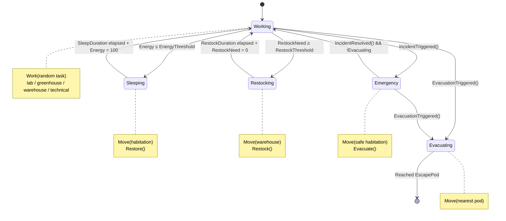
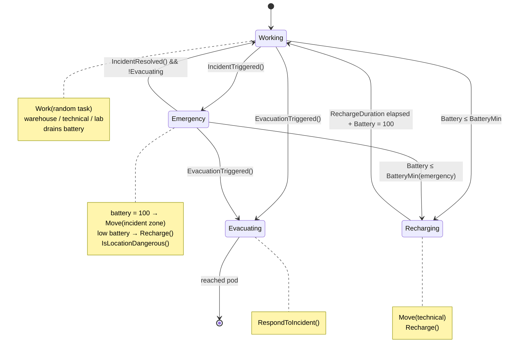
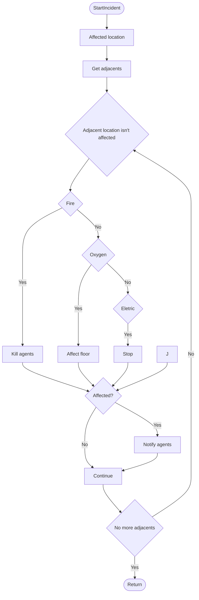

# Projeto 1 - Cúpula Espacial - IA

#### Autoria:

- Dinis Barroso - A22405350
- Frederico Carvalho - A22406033
- Gonçalo Ribeiro - A22409619

#### Carga de Trabalho

- Dinis Barroso:
  Programação dos FSM e Sistema de movimento dos agentes, bem como os seus controladores,scripts de construtor, factory e Finite State Machines.

  Criação dos scripts de visualização dos incidentes, e programação inicial dos mesmos.

  Escrita do relatório.

- Frederico Carvalho:
  A minha principal contribuição para o projeto consistiu na melhoria do sistema de deteção de localização dos agentes, através da implementação de uma abordagem baseada em triggers utilizando colliders. Esta alteração permitiu que os agentes identificassem corretamente quando se encontram dentro de uma localização, resolvendo um problema crítico em que não estavam a ser detetados corretamente. Como consequência, foi possível corrigir uma falha no sistema de incidentes, onde os agentes não morriam quando expostos a incêndios ou fugas de oxigénio.
  
  Para além disso, configurei e ajustei os colliders de cada localização de forma a cobrirem corretamente as áreas das salas, o que foi essencial para assegurar uma deteção fiável. Por fim, criei e organizei os assets das salas em todas as areas.


- Gonçalo Ribeiro:
  A minha principal contribuiçao neste projeto foi a criação do layout para o projeto: as áreas principais e corredores, e a criação dos scripts para os incidentes

## Introdução

- Este projeto tenta simular uma colónia espacial que contém um número de agentes, cada um com as suas rotinas e valores.

    Para o conseguir, utilizamos **FSM (Finite State Machines)**, com seleção de comportamentos por prioridade, consoante os valores do agente e os incidentes a ocorrer na cúpula.

    Inicialmente pensámos em usar **Behaviour Trees**, mas acabámos por usar **Finite State Machines** por serem mais simples de realizar, e por terem menos impacto na preformance, visto que os agentes não são complexos e têm tarefas bem simples.

    Para movimento, utilizámos o NavMesh da Unity, que obtém um ponto livre do sítio onde o agente se quer localizar.

- Na pesquisa usámos como referências os seguintes artigos:

    - **ABMU: An Agent-Based Modelling Framework for Unity3D** para desenvolver o movimento em NavMesh e comportamento dos agentes, onde cada um tem os seus "Tick" por segundo e as suas variáveis, que lhes atualizam a rotina.
    - **Evacuation Simulation Implemented by ABM-BIM of Unity** para desenvolver o comportamento dos agentes consoante um incidente esteja a acontecer.

## Metodologia


O projeto foi implementado em 2.5D, sem verticalidade por opção, com movimentação dinâmica, onde os agentes tentam encontrar caminhos para evitar colisões, com uma velocidade decidida aleatoriamente.

Os agentes navegam através do chão que contém ```NavMeshSurfaces```, em conjunto com os componentes ```Location.cs``` e ```NavigationArea.cs```, que lhes dizem que locais são, que depois obtêm um ponto aleatório das zonas pelo ```LocationManager.cs```, que faz uso do **Provider Pattern**.

Cada agente contém uma Máquina de Estados finitos (FSM), implementada com ```AgentStateMachine.cs``` que atualiza cada frame pelo método ```Tick.cs```. Inicialmente pensámos em fazer uma Behaviour Tree com o uso de ActiveLT mas mudámos para esta abordagem mais hábil.

Ambos os dois tipos de agentes têm máquinas de estado diferentes, baseados na mesma interface ```IAgentBehaviour.cs```.

### Diagrama UML da classe ```CrewmateStates.cs```



### Diagrama UML da classe ```RobotStates.cs```



Os valores do simulador podem ser modificados, podendo serem mudados o número de agentes que nascem e quantos agentes podem estar numa ```Location.cs```. Cada agente tem valores de velocidade e de tempo, mas esses não são parametrizados, tendo de ser modificados por código.

Também é possível modificar os valores dos incidents pelo ```IncidentManager.cs```, a velocidade de propagação, quanto demora um incidente e número máximo de propagação.

Para os incidentes, decidimos usar a **Observer Pattern**, onde os agentes são avisados quando um incidente está a acontecer, se é uma emergência, se foi resolvida, e se matou algum agente, pelo ```IncidentManager.cs```.

Quando um agente recebe a informação de que aconteceu um incidente, ativa o seu **estado de emergência** e multiplica por 1.5 a sua velocidade.

Consoante o número de módulos agravados, os tripulantes entram em **estado de evacuação**, onde vão todos para uma **EscapePod**.

Existem 3 tipos de incidentes que podem ser ativados pelos botões da UI. Quando um deles é clicado, seleciona uma ```Location.cs``` aleatória para começar, retornando null caso calhe um *Pod*.

Todos os incidentes que acontecem são guardados e geridos pelo script ```IncidentManager.cs```, onde podem ser resolvidos a pedido do jogador, ou por um agente do tipo ```Robot.cs```.

**Fogo** - Quando iniciado, mata todos os agentes que se encontram na ```Location.cs``` e torna-o impassável, ou seja, todos os agentes que tentem entrar, morrem.

Consoante o tempo, propaga-se para outros locais.

**Oxigénio** - Semelhante ao fogo, mas apenas os tripulantes podem morrer, enquanto os robôs ficam inafetados.

**Elétrico** - Quando iniciado, o cubículo escolhido ativa uma variável do componente ```Door.cs``` da porta que lhe obriga a ativar o ```NavMeshObstacle``` da mesma. Ao contrário dos outros incidentes, este não se propaga.

Para propagação, cada local contém uma lista de outros locais perto do mesmo, de onde o ```IncidentManager.cs``` os vai buscar.



## Resultados e discussão


Consoante os nossos testes, verificamos que no inicio os agentes tentam passar sempre pelos outros sem forma de ultrapassar ou de esperar, por isso andam aos empurrões.

Adicionalmente, alguns agentes começam dentro do dormitório/zona técnica pois não começam recarregados.


Verificámos também que quando uma porta é completamente bloqueada por corpos, os outros agentes são impossibilitados de realizar as suas tarefas, mas continuam a tentar.


Durante um incidente elétrico, os **tripulantes** até são espertos e tentam escolher outra tarefa  se aquela que vão fazer estiver trancada.
Também tentam escolher outro **dormitório** se este estiver trancado.

Consoante a parameterizção, verificámos que mesmo que a performance do programa esteja boa,
a dos agentes não, tornando-se impossível de navegar pelo espaço.
Portanto não chegámos a testar muito o número inicial.

Durante emergências, verificámos que os **tripulantes** têm tendência a ficar nos **dormitórios** durante emergências em vez dos *Pods*. Possívelmente pelo número baixo que os mesmos aguentam.

Quando aumentámos a velocidade de propagação do **fogo**, tornou-se mais difícil para os **robôs** o solucionarem, mas ainda assim pensamos que os **robôs** estão rápidos demais, ou talvez seja pelo número dos mesmos.

De acordo com os resultados, temos de melhorar o uso do NavMesh ou utilizar outra alternativa de todo para o movimento.

Para solucionar o problema dos corpos, é melhor adicionar um **Rigibody** para os mesmos para ser possível empurrar.

Para o problema dos robôs, talvez adicionar ao código dos FSM deles que só um possa arranjar um local no momento e que os outros realizem outras funções.

## Conclusão

O projeto propôs uma cúpula espacial onde cada agente é autónomo, e de onde acontecem incidentes de acordo (ou não) com o utilizador.

Utilizando **FSMs** com objetivos definidos e as suas variáveis, em conjunto com o sistema de navegação **NavMesh**, conseguimos fazer os agentes terem uma rotina própria, mesmo não sendo perfeita. Esta rotina é atualizada com a mesma ideia do primeiro artigo, que usa Ticks por segundo para o realizar.

Com o uso da abordagem **Observer**, de acordo com o estúdo que fizemos no segundo artigo, conseguimos fazer os agentes quebrarem o seu ciclo caso haja um incidente, mesmo que ainda seja necessário *fine tuning* das variáveis, pois os robôs realizavam as tarefas demasiado rápido.

Devido às limitações do **NavMesh**, obtivemos alguns problemas de movimentação, que não os permitia empurrar corpos mortos, ou andavam aos encontrões quando estavam num corredor.

Vimos que os **tripulantes** preferiam ficar nos seus dormitórios, enquanto poucos deles iam para os *Pods*, por não terem uma lógica de decisão.

No final, o projeto acabou com alguns problemas como estes, que possam ser solucionados com outros tipos de movimento ou mesmo de pensamento da I.A, mas mesmo assim, os agentes têm capacidade de reagir consoante os incidentes, mesmo que não seja de uma maneira precisa.

## Referências

- Unity Technologies, “NavMesh Agent,” Unity Manual. [Online]. Available: https://docs.unity3d.com/Manual/class-NavMeshAgent.html

- K. Cheliotis, “ABMU: An Agent-Based Modelling Framework for Unity3D,” SoftwareX, vol. 15, p. 100771, 2021.

- Z. Guo, Y. Huang, H. Chu, and R. Sengupta, “Evacuation Simulation Implemented by ABM-BIM of Unity in Students’ Dormitory Based on Delay Time,” ISPRS International Journal of Geo-Information, vol. 12, no. 4, p. 160, 2023.

- Behavior Trees or Finite State Machines. Opsive. https://opsive.com/support/documentation/behavior-designer/behavior-trees-or-finite-state-machines/
‌